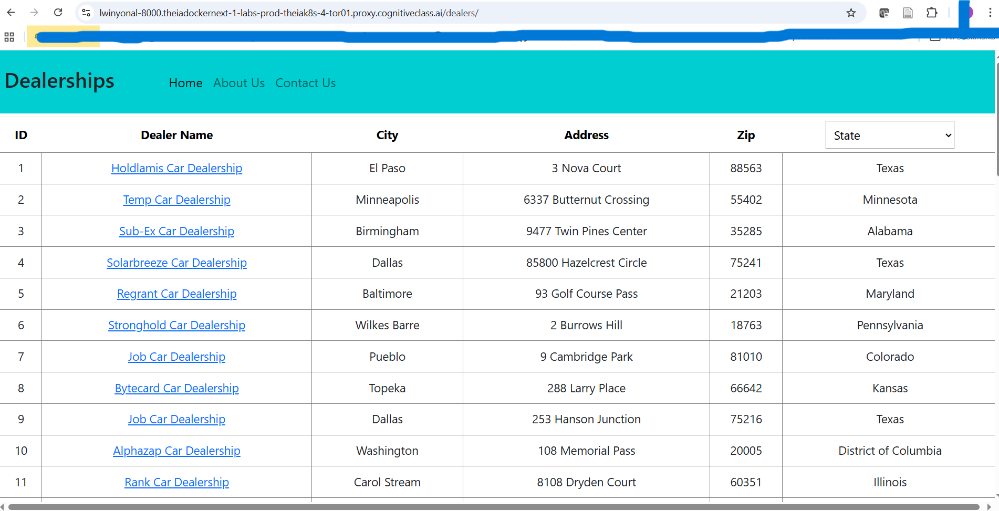
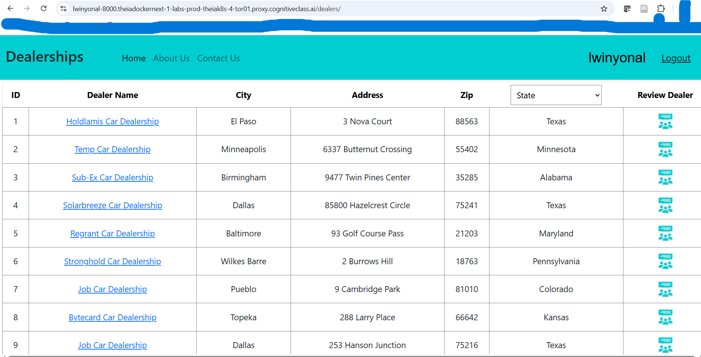
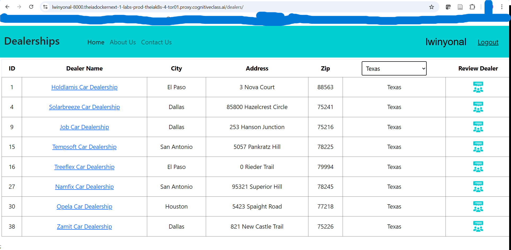
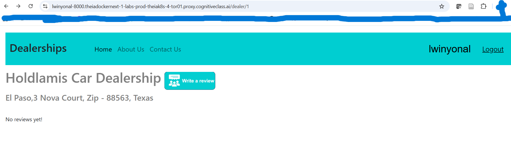
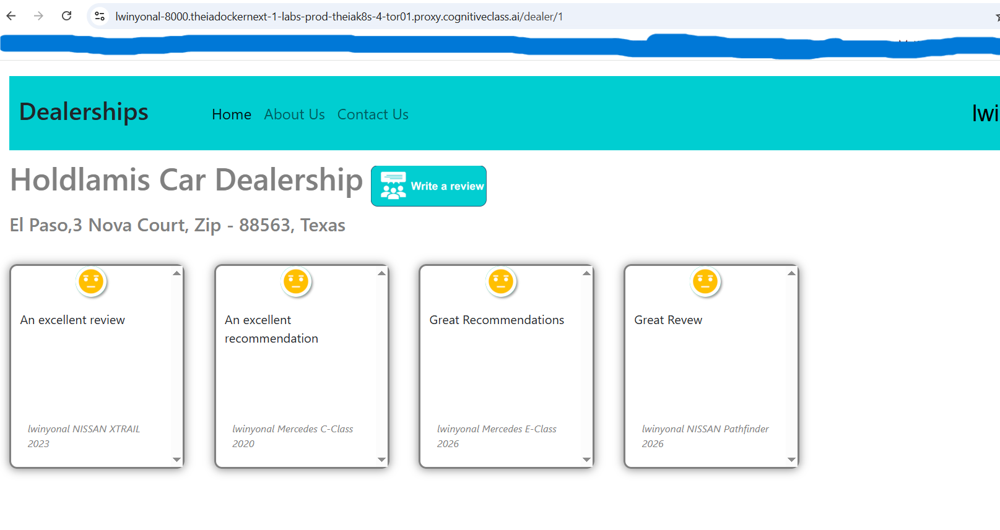
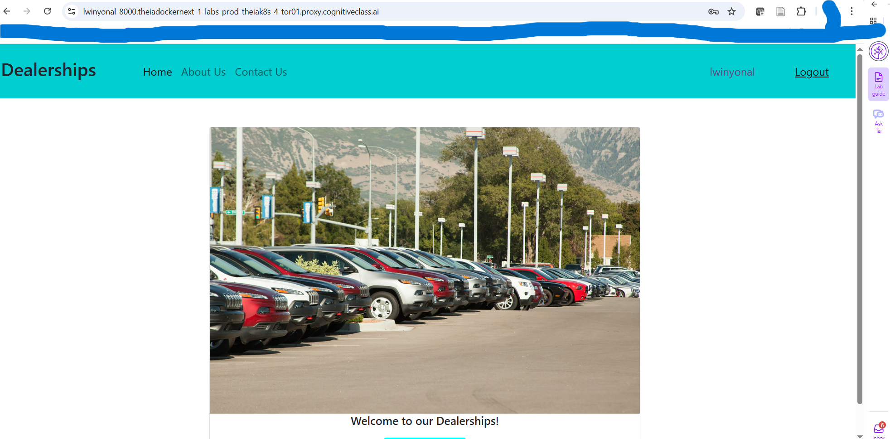
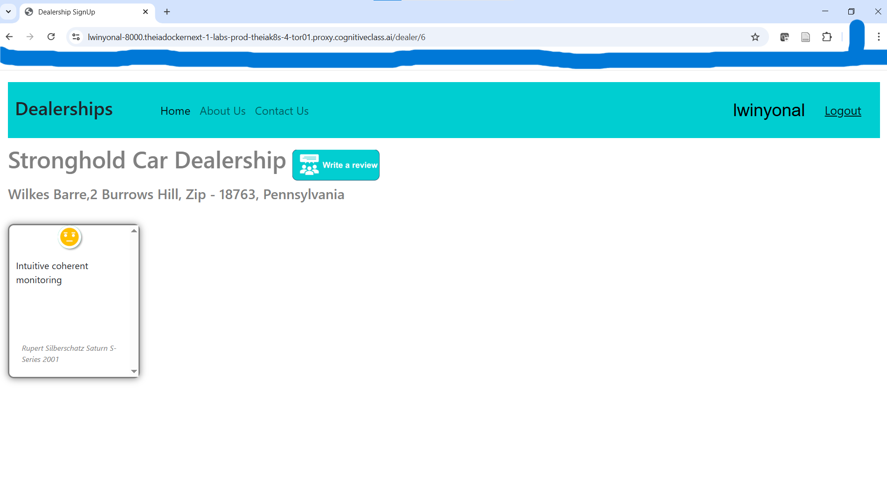
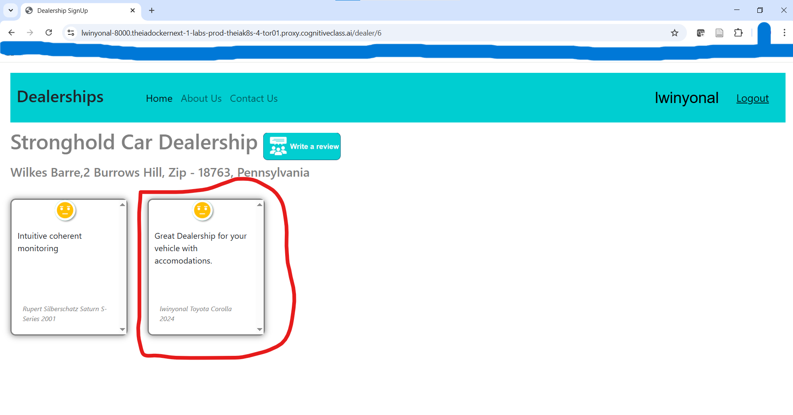

# coding-project-template

#### About.html File
https://github.com/LwinMat/fullstack_developer_capstone/blob/main/server/frontend/static/About.html

#### Contact.html File
https://github.com/LwinMat/fullstack_developer_capstone/blob/main/server/frontend/static/Contact.html

#### Register.jsx File
https://github.com/LwinMat/fullstack_developer_capstone/blob/main/server/frontend/src/components/Register/Register.jsx

## Dealers Page


## Dealers + Logged In


## Dearler By State


## Dealer Details


## Post Review Page



## CI/CD Output 

### Python

```
Run pwd
  pwd
  # This command finds all Python files recursively and runs flake8 on them
  find . -name "*.py" -exec flake8 --max-line-length=150 {} +
  echo "Linted all the python files successfully"
  shell: /usr/bin/bash -e {0}
  env:
    pythonLocation: /opt/hostedtoolcache/Python/3.12.12/x64
    PKG_CONFIG_PATH: /opt/hostedtoolcache/Python/3.12.12/x64/lib/pkgconfig
    Python_ROOT_DIR: /opt/hostedtoolcache/Python/3.12.12/x64
    Python2_ROOT_DIR: /opt/hostedtoolcache/Python/3.12.12/x64
    Python3_ROOT_DIR: /opt/hostedtoolcache/Python/3.12.12/x64
    LD_LIBRARY_PATH: /opt/hostedtoolcache/Python/3.12.12/x64/lib
/home/runner/work/fullstack_developer_capstone/fullstack_developer_capstone
Linted all the python files successfully
```

### JavaScript
```
Run # This command finds all JavaScript files recursively and runs JSHint on them
  # This command finds all JavaScript files recursively and runs JSHint on them
  find ./server/database -name "*.js" -exec jshint {} +
  echo "Linted all the js files successfully"
  shell: /usr/bin/bash -e {0}
Linted all the js files successfully
```


### Deployed Landing Page


### Deployed Logged In


### Deployed Dealer Detail


### Deployed Add Review
